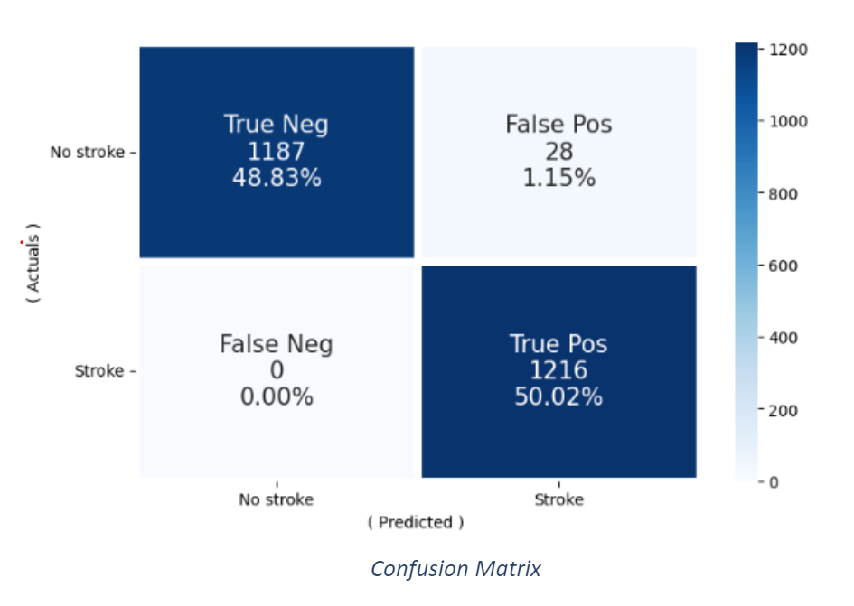

# ischemic-stroke-detection

## Modeling Process
- I used the programming languages: Python and Panda - for data loading and processing, Matplotlib for data Visualization and sklearn for machine learning and statistical modeling. Also, Jupyter was used as a web-based interactive development environment for developing the models and visualization. 
Machine Learning models are a multi-step process depicted in the below figure:

## Modeling Principles 
- Many machine learning algorithms fail if the dataset contains missing values. 
- You may end up building a biased machine learning model, leading to incorrect results if the missing values are not handled properly.
- Missing data can lead to a lack of precision in the statistical analysis.
- Identify Data Anomalies like features having irrelevant  values, like smoking status having ‘unknown’ values.
- Reduce Dimensions by eliminating dimensions that don’t contribute to the target value.
- Remove outliers data to improve accuracy of algorithm. 
- Divide datasets into training and testing.
- The Independent Variables are Features that determine the Target Variable need to be at a similar scale and this specifically applies to classification algorithms.  Feature Scaling is important for accuracy of distance-based algorithms like KNN, SVM etc. since they are using distances between data points.
- Handle Imbalanced Data, else you would have skewed models that will help detect target output that are biased towards the majority class of features.
- Training Datasets need to be processed via multiple algorithms for determining best performance & accuracy. Also certain models depending on the nature of datasets will be more resilient to data anomalies.

## Model Architecture

## Machine Learning / Supervised Learning Model / Pre-Processing / Model Training

## Model Accuracy

##  Confusion Matrix

